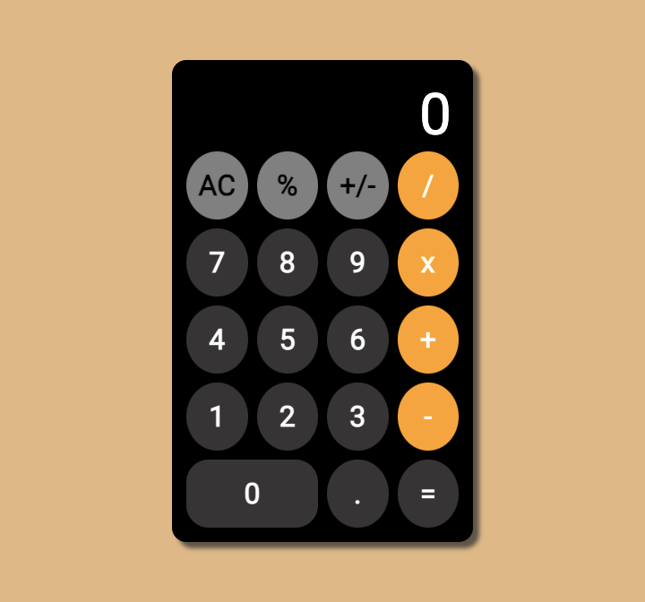

# Calculator Application

Calculator Application is a front end project to make simple calculations (ex. addition, subtraction, multiplication, division, etc.)

## Links

- [Live Demo](https://calculator-app-client.netlify.app/)

## Screenshots

## Technology

### Built with:

- React, including useState and useEffect
  - Created with [create-react-app](https://github.com/facebook/create-react-app)
